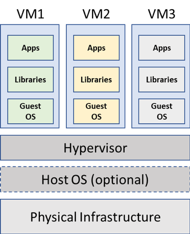
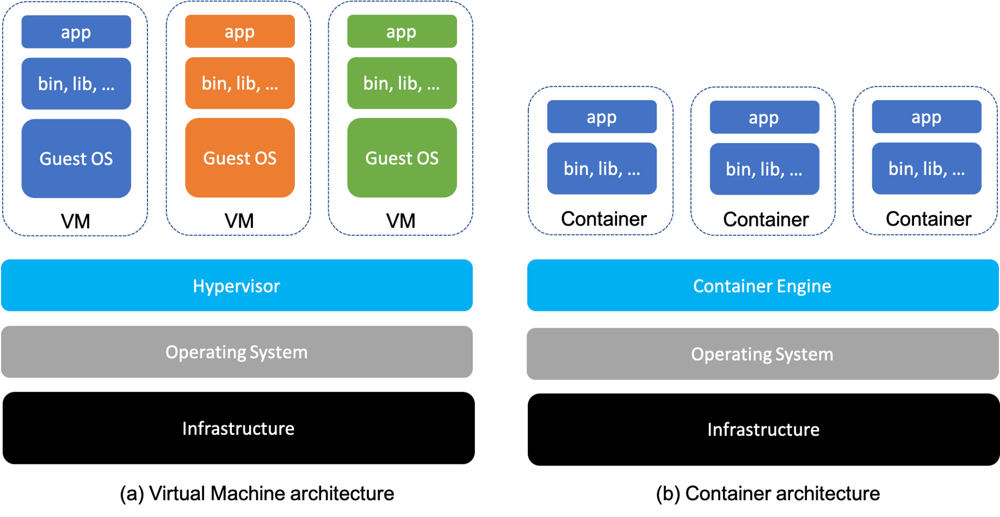

# History for the evolution of Docker

## What is Virtualization ?
-   Virtualization is the process of running multiple virtual systems or resources on top of a single physical machine. These resources could be a storage device,network or even an Operating system.

### Problems before Virtualization
-   Use case : Consider we have 2 softwares i.e, **software-A** which runs only on Windows and **software-B** which runs only on Ubuntu. To run these 2 softwares we had to buy 2 server's one with Ubuntu O.S and another with Windows O.S. If you see Windows server has only **software-A** running and Ubuntu server has **software-B** and nothing else. The resources such as CPU, memory(RAM), storage etc is not utilized completely.

-   Buying servers is expensive
-   Resources were not being utilized at their potential
-   The process of getting any software up and running was time consuming.
-   Disaster recovery was difficult.

### After of Virtualization
-   Windows and Ubuntu O.S are now running on the same server in parallel using virtualization technology. This accounts for better resource(CPU,RAM etc) utilization and cost saving.

-   Cost saving
-   Resources are utilized more efficiently
-   Process of getting software up and running is shorter
-   Easier backup and disaster recovery is available.

